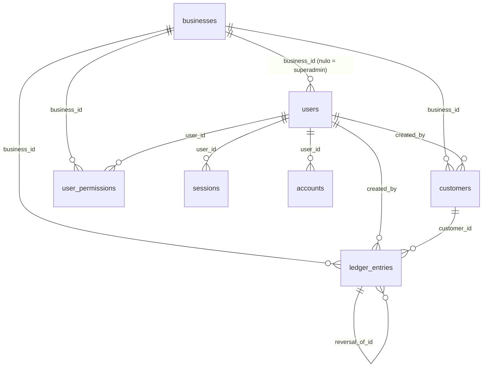
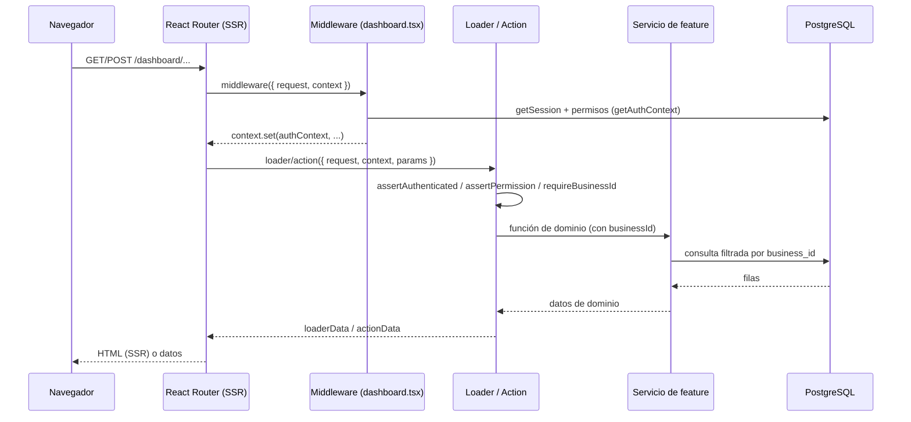

# Store Manager — Documentación técnica completa

Aplicación web para **gestionar deudas y créditos de clientes en tiendas locales**.
Permite registrar clientes, registrar deudas y abonos (pagos parciales o totales),
corregir movimientos y calcular saldos individuales y globales de forma precisa.

Este documento es la referencia de **qué hace el proyecto, cómo está construido y
por qué**, para que puedas explorarlo, apropiártelo y entenderlo a nivel general y
técnico.

---

## Índice

1. [Resumen y estado actual](#1-resumen-y-estado-actual)
2. [Pila tecnológica](#2-pila-tecnológica)
3. [Principios de diseño](#3-principios-de-diseño)
4. [Arquitectura general](#4-arquitectura-general)
5. [Modelo de datos](#5-modelo-de-datos)
6. [Reglas de negocio](#6-reglas-de-negocio)
7. [Autenticación y autorización (RBAC granular)](#7-autenticación-y-autorización-rbac-granular)
8. [Estructura de carpetas](#8-estructura-de-carpetas)
9. [Mapa de rutas de la aplicación](#9-mapa-de-rutas-de-la-aplicación)
10. [Ciclo de vida de una petición](#10-ciclo-de-vida-de-una-petición)
11. [Servicios por feature](#11-servicios-por-feature)
12. [Interfaz, estilos y notificaciones](#12-interfaz-estilos-y-notificaciones)
13. [Convenciones de código](#13-convenciones-de-código)
14. [Base de datos y migraciones](#14-base-de-datos-y-migraciones)
15. [Configuración y entorno](#15-configuración-y-entorno)
16. [Puesta en marcha](#16-puesta-en-marcha)
17. [Scripts disponibles](#17-scripts-disponibles)
18. [Cómo extender el proyecto (recetas)](#18-cómo-extender-el-proyecto-recetas)
19. [Decisiones técnicas y limitaciones conocidas](#19-decisiones-técnicas-y-limitaciones-conocidas)
20. [Roadmap / ideas pendientes](#20-roadmap--ideas-pendientes)
21. [Glosario](#21-glosario)

---

## 1. Resumen y estado actual

### Funcionalidades implementadas

- **Autenticación** por correo y contraseña (Better Auth), con sesión por cookie.
- **Multi-tenancy** en una sola base de datos, con aislamiento por fila vía
  `business_id`.
- **RBAC granular** por permisos (no roles rígidos) + un **Administrador Global
  (Superadmin)** sin tienda asignada.
- **Clientes**: listar, buscar, crear, editar y desactivar (borrado lógico).
- **Ledger (libro mayor)**: registrar deudas y abonos como entradas inmutables.
- **Anulación y corrección de movimientos** por **contra-asiento** (permiso
  `ledger:adjust`), conservando el historial.
- **Panel (dashboard)**: métricas, gráficas (Recharts) y ranking de deudores.
- **Gestión de tiendas** (CRUD, activar/desactivar, eliminar con validaciones).
- **Gestión de usuarios y permisos** por tienda, incluyendo
  **restablecimiento de contraseña** por parte del administrador.
- **Informes** por rango de fechas con **exportación a CSV**.
- **Superadmin global**: panel de todas las tiendas y selector de **tienda activa**.

### Usuarios de ejemplo (creados por el seed)

| Usuario | Correo | Contraseña | Alcance |
| --- | --- | --- | --- |
| Superadmin | `admin@store-manager.local` | `superadmin1234` | Global (sin `business_id`) |
| Encargado | `encargado@store-manager.local` | `encargado1234` | Tienda "Doña Rosa" |

---

## 2. Pila tecnológica

| Área | Tecnología | Versión aprox. |
| --- | --- | --- |
| Framework web | **React Router v8** (framework mode, SSR, loaders/actions, middleware) | `^8.4.0` |
| UI | **React 19** | `^19.3.0` |
| Build / dev server | **Vite 8** + plugin `@react-router/dev` | `^8.0.3` |
| Runtime / paquetes | **Bun** | `1.4.2` |
| Autenticación | **Better Auth** + `@better-auth/drizzle-adapter` | `^1.7.7` |
| Base de datos | **PostgreSQL** en Docker | `postgres:17-alpine` |
| ORM | **Drizzle ORM** + **Drizzle Kit** | `^0.45.3` / `^0.31.11` |
| Driver SQL | `pg` (node-postgres) | `^8.23.1` |
| Estilos | **Tailwind CSS v4** (Mobile-First) + tokens de **shadcn/ui** | `^4.3.3` |
| Componentes UI | **shadcn/ui** (new-york) + primitivos **radix-ui** | `^1.7.0` |
| Notificaciones | **sileo** (toasts) | `^0.1.5` |
| Gráficas | **Recharts** | `^3.10.1` |
| Validación | **Zod** | `^4.6.5` |
| Lenguaje | **TypeScript** (target ES2022, ESM) | `^5.9.3` |

> React Router v8 es ESM-only y requiere Node 22.22+/React 19.2.7+/Vite 7+.
> El proyecto usa **Bun** como gestor de paquetes y runtime para scripts.

---

## 3. Principios de diseño

1. **Inmutabilidad contable.** Las deudas y abonos son entradas de un *ledger*
   append-only. Nunca se hace `UPDATE` de `amount`/`type` ni `DELETE`. Para
   corregir se usa un **contra-asiento** (ver §6).
2. **Aislamiento multi-tenant estricto.** Toda tabla de negocio incluye
   `business_id` obligatorio e indexado. **Toda** consulta o mutación filtra por
   el `business_id` resuelto desde la sesión/contexto.
3. **Precisión monetaria.** Los montos se guardan como **enteros en centavos**
   (unidad mínima) para evitar errores de punto flotante.
4. **Permisos granulares, no roles.** El acceso se decide con permisos como
   `customers:create` o `ledger:adjust`. El Superadmin omite las comprobaciones.
5. **Seguridad en profundidad.** Los permisos se validan **en el servidor** en
   cada loader/action; la UI solo oculta lo que no corresponde, nunca es la
   única barrera. Los campos sensibles (`business_id`, `is_superadmin`) son
   `input: false` en Better Auth para impedir escaladas.
6. **DX y legibilidad.** Arquitectura simple por *features*, tipos inferidos del
   esquema, comentarios en español y nombres en inglés.
7. **Mobile-First.** La UI se diseña primero para móvil y escala a escritorio con
   utilidades responsivas de Tailwind.

---

## 4. Arquitectura general

El proyecto usa **React Router en framework mode** con SSR. Cada URL se resuelve
con una *route module* que puede exportar `loader` (lectura), `action` (mutación),
`middleware`, `meta`, `ErrorBoundary` y el componente por defecto.

Capas:

```
Rutas (app/routes/*)         → UI + loaders/actions (orquestación y permisos)
Middleware (dashboard.tsx)   → resuelve sesión/permisos → contexto
Guards (lib/session.server)  → assertAuthenticated / assertPermission / ...
Servicios (features/*/services) → lógica de dominio + acceso a datos scoped
Esquema (db/schema/*)        → definición de tablas, enums, relaciones
Cliente DB (db/client.server) → pool pg + Drizzle
```

Regla clave: **las rutas no escriben SQL directamente**; delegan en servicios de
feature, que siempre reciben y filtran por `business_id`.

### Diagrama de entidades (ER)



---

## 5. Modelo de datos

PostgreSQL. 8 tablas. Los identificadores de negocio son `uuid` con
`defaultRandom()`; las tablas de Better Auth usan `text` (ids que genera la
librería).

### `businesses` — tienda (raíz del tenant)

| Columna | Tipo | Notas |
| --- | --- | --- |
| `id` | uuid PK | `defaultRandom()` |
| `name` | text | obligatorio |
| `slug` | text | obligatorio, **único** |
| `currency` | text | ISO 4217, por defecto `"COP"` |
| `timezone` | text | IANA, por defecto `"America/Bogota"` (Colombia, UTC-5) |
| `is_active` | boolean | por defecto `true` |
| `created_at`, `updated_at` | timestamptz | |

### `users` — usuarios (Better Auth + campos propios)

| Columna | Tipo | Notas |
| --- | --- | --- |
| `id` | text PK | |
| `name`, `email` | text | `email` único |
| `email_verified` | boolean | |
| `image` | text | |
| `business_id` | uuid FK → businesses | **nulo = Superadmin**; `on delete set null` |
| `is_superadmin` | boolean | bypass total de permisos |
| `created_at`, `updated_at` | timestamptz | |

Índice: `users_business_id_idx`.

### `sessions` / `accounts` / `verifications` — Better Auth

- `sessions`: `id`, `expires_at`, `token` (único), `ip_address`, `user_agent`,
  `user_id` (FK → users, cascade), timestamps.
- `accounts`: `id`, `account_id`, `provider_id`, `user_id`, tokens OAuth, `scope`,
  **`password`** (hash de credenciales), timestamps.
- `verifications`: `id`, `identifier`, `value`, `expires_at`, timestamps.

> Better Auth guarda el **hash de la contraseña** en `accounts.password` con
> `provider_id = "credential"`.

### `customers` — clientes

| Columna | Tipo | Notas |
| --- | --- | --- |
| `id` | uuid PK | |
| `business_id` | uuid FK | obligatorio, indexado |
| `first_name`, `last_name` | text | obligatorios |
| `phone`, `email`, `address`, `notes` | text | opcionales |
| `is_active` | boolean | borrado lógico |
| `created_by` | text FK → users | `set null` |
| `created_at`, `updated_at` | timestamptz | |

Índices: `customers_business_id_idx`, `customers_business_name_idx`
(`business_id`, `last_name`, `first_name`).

### `ledger_entries` — libro mayor (transacciones)

| Columna | Tipo | Notas |
| --- | --- | --- |
| `id` | uuid PK | |
| `business_id` | uuid FK | obligatorio, indexado |
| `customer_id` | uuid FK → customers | cascade |
| `amount` | integer | **centavos, siempre > 0** (CHECK) |
| `type` | enum `ledger_entry_type` | `DEBT` \| `PAYMENT` |
| `description` | text | opcional |
| `voided_at` | timestamptz | marca la entrada como anulada |
| `voided_by` | text FK → users | quién anuló |
| `reversal_of_id` | uuid FK → ledger_entries | apunta al original desde el reverso |
| `created_by` | text FK → users | `restrict` (no borrar usuarios con movimientos) |
| `created_at` | timestamptz | |

Índices: `business_id`, `customer_id`, `(business_id, customer_id)`,
`created_at`, `reversal_of_id`. CHECK: `amount > 0`.

### `user_permissions` — permisos granulares

| Columna | Tipo | Notas |
| --- | --- | --- |
| `id` | uuid PK | |
| `business_id` | uuid FK | obligatorio |
| `user_id` | text FK → users | cascade |
| `permission` | text | clave del catálogo (validada con Zod) |
| `granted_by` | text FK → users | `set null` |
| `created_at` | timestamptz | |

Índices: **único** `(user_id, permission)`, `business_id`, `user_id`.

### Enum `ledger_entry_type`

`DEBT` (el cliente adquiere deuda) y `PAYMENT` (abono/pago).

### Relaciones (Drizzle v1)

Definidas en `app/db/schema/relations.ts`. Nota: `user_permissions` tiene **dos**
FK hacia `users` (`user_id` y `granted_by`), por lo que se usa `relationName`
(`user_permissions_userId` / `user_permissions_grantedBy`) para desambiguar.

---

## 6. Reglas de negocio

### Multi-tenancy

- Una sola base de datos, aislamiento por fila (`business_id`).
- Todas las tablas de negocio incluyen `business_id` obligatorio e indexado.
- Cada servicio recibe `businessId` y lo usa en el `WHERE` (o en el `ON` de un
  `LEFT JOIN`).

### Contabilidad (ledger)

- Las deudas y pagos son **entradas inmutables**.
- Los montos son **enteros en centavos** y positivos; el `type` define la dirección.
- **Saldo del cliente** (solo entradas vigentes):

  ```
  balanceCents     = SUM(PAYMENT) - SUM(DEBT)
  outstandingCents = SUM(DEBT) - SUM(PAYMENT)   // deuda pendiente (positiva si debe)
  ```

- **Anulación / corrección (contra-asiento).** No se edita la fila:
  1. Se marca la original como anulada (`voided_at`, `voided_by`).
  2. Se inserta un **reverso** (tipo opuesto, mismo monto) con `reversal_of_id`.
  3. En una **corrección**, además se inserta la **entrada corregida**.

  Los agregados (saldo, métricas, informes) **excluyen** anulados y reversos, así
  que solo cuentan las entradas vigentes; el historial completo se conserva.

- **No se puede pagar más de lo que se debe.** Ningún abono, corrección ni
  anulación puede dejar el saldo pendiente (`outstandingCents`) en negativo. La
  validación vive en el servidor (`ledger.server.ts`) y devuelve un error claro;
  la UI solo lo muestra.

### Moneda

- Moneda por defecto **COP** (peso colombiano), locale `es-CO`.
- Se guarda en centavos; `Intl.NumberFormat` muestra los decimales propios de la
  moneda (COP: 0 decimales).
- `businesses.currency` permite otras monedas a futuro (los totales globales hoy
  asumen COP).

### Zona horaria

- Los instantes se guardan en UTC (`timestamptz`), pero la aplicación opera en
  **Colombia (UTC-5)**.
- `businesses.timezone` (IANA, por defecto `America/Bogota`) define la zona para
  los **límites de día/mes** de los informes, la **agrupación del flujo mensual**
  y el **formato de fechas** mostradas.
- La conversión se concentra en `app/lib/time.ts`; un movimiento registrado a las
  23:30 hora local cuenta en ese día (no en el siguiente) aunque en UTC ya sea
  otro día.

---

## 7. Autenticación y autorización (RBAC granular)

### Better Auth (`app/lib/auth.server.ts`)

- Email + contraseña habilitado. Adaptador Drizzle con `usePlural: true`.
- Campos adicionales del usuario: `businessId` e `isSuperadmin`, ambos
  **`input: false`** (solo se asignan en el servidor).
- `advanced.database.joins: true` para endpoints como `/get-session`.

### Contexto de autorización (`app/lib/session.server.ts`)

`getAuthContext(request)`:
1. Llama a `auth.api.getSession({ headers })`.
2. Extrae `businessId` e `isSuperadmin`.
3. Si no es Superadmin, carga sus permisos desde `user_permissions` y los valida
   contra el catálogo (filtrando claves inválidas).

Devuelve:

```ts
type AuthContext = {
  user: { id: string; name: string; email: string };
  businessId: string | null;
  isSuperadmin: boolean;
  permissions: ReadonlySet<Permission>;
};
```

### Guards

| Función | Efecto |
| --- | --- |
| `assertAuthenticated(ctx)` | Si no hay sesión → `redirect("/login")` |
| `assertPermission(ctx, perm)` | Si falta el permiso (y no es Superadmin) → `403` |
| `assertSuperadmin(ctx)` | Si no es Superadmin → `403` |
| `requireBusinessId(request, ctx)` | Resuelve la tienda activa o redirige al selector de tienda (Superadmin) / 403 (usuario sin tienda) |

### Superadmin y "tienda activa"

El Superadmin no tiene `business_id`. Para operar sobre una tienda elige una
**tienda activa** guardada en la cookie `sm_active_business`
(`app/lib/business-context.server.ts`):

- Usuario normal → `business_id` propio.
- Superadmin → valor de la cookie (validado como UUID); si no hay, redirige al
  panel global para elegir.

### Catálogo de permisos (`app/lib/permissions.ts`)

12 permisos agrupados por recurso:

| Recurso | Permisos |
| --- | --- |
| Tiendas | `businesses:manage` |
| Clientes | `customers:create`, `customers:read`, `customers:update`, `customers:delete` |
| Deudas | `debts:create`, `debts:read` |
| Abonos | `payments:create`, `payments:read` |
| Correcciones | `ledger:adjust` |
| Métricas | `metrics:read` |
| Usuarios | `users:manage` |

- `GLOBAL_PERMISSIONS = ["businesses:manage"]`: solo el Superadmin puede otorgarlo.
- `grantablePermissions(isSuperadmin)`: filtra lo que cada actor puede conceder
  (un usuario de tienda no puede otorgar permisos globales).
- `permissionSchema` (Zod) valida entradas.

---

## 8. Estructura de carpetas

```
store-manager/
├── app/
│   ├── app.css                 # Tailwind v4 + tokens de shadcn (claro/oscuro)
│   ├── root.tsx                # Layout raíz: <html>, <Meta>, <Links>, Toaster (sileo)
│   ├── routes.ts               # Configuración explícita de rutas
│   ├── context.ts              # createContext<AuthContext | null>
│   ├── components/
│   │   ├── money-input.tsx     # Entrada de dinero con separador de miles (visual)
│   │   ├── mobile-nav.tsx      # Barra de navegación inferior (móvil)
│   │   ├── customer-search.tsx # Búsqueda de clientes con autocompletado
│   │   ├── flash-toast.tsx     # Notificación de éxito tras un redirect (?flash=)
│   │   ├── submit-button.tsx   # Botón con spinner + bloqueo anti doble-envío
│   │   ├── theme-toggle.tsx    # Tema claro/oscuro/sistema (+ script anti-flash)
│   │   └── ui/                 # shadcn/ui: button, card, input, label, select, …
│   │
│   ├── db/
│   │   ├── client.server.ts    # Pool de pg + instancia Drizzle (singleton en dev)
│   │   ├── seed.server.ts      # Datos de ejemplo (idempotente)
│   │   └── schema/
│   │       ├── enums.ts            # ledger_entry_type (DEBT/PAYMENT)
│   │       ├── businesses.ts       # Tiendas
│   │       ├── auth.ts             # users, sessions, accounts, verifications
│   │       ├── customers.ts        # Clientes
│   │       ├── ledger-entries.ts   # Libro mayor
│   │       ├── user-permissions.ts # Permisos por usuario
│   │       ├── relations.ts        # Relaciones Drizzle
│   │       └── index.ts            # Barrel del esquema
│   │
│   ├── features/               # Lógica de dominio por característica
│   │   ├── businesses/services/business.server.ts   # CRUD de tiendas + métricas
│   │   ├── customers/services/customer.server.ts    # CRUD de clientes
│   │   ├── ledger/services/ledger.server.ts         # Deudas, abonos, saldos, anulación
│   │   ├── users/services/user.server.ts            # Usuarios, permisos, contraseñas
│   │   ├── metrics/
│   │   │   ├── services/metrics.server.ts           # Métricas y flujo mensual
│   │   │   └── components/balance-charts.tsx        # Gráficas (Recharts)
│   │   └── reports/
│   │       ├── report-range.ts                      # Parseo del rango from/to
│   │       └── services/report.server.ts            # Resumen, movimientos, por cliente
│   │
│   ├── lib/
│   │   ├── auth.server.ts          # Configuración de Better Auth
│   │   ├── auth-client.ts          # Cliente de Better Auth (navegador)
│   │   ├── session.server.ts       # AuthContext + guards
│   │   ├── business-context.server.ts # Cookie de tienda activa + requireBusinessId
│   │   ├── permissions.ts          # Catálogo de permisos
│   │   ├── env.server.ts           # Validación de entorno con Zod
│   │   ├── money.ts                # Centavos ↔ decimal, formato de moneda
│   │   ├── time.ts                 # Zona horaria (America/Bogota): día/mes, formato
│   │   ├── csv.ts                  # Generación de CSV
│   │   └── utils.ts                # cn(), safeRedirect(), formatDate()
│   │
│   ├── types/index.ts          # Tipos de dominio (inferidos del esquema + DTOs)
│   │
│   └── routes/                 # Route modules (ver §9)
│
├── public/                     # Assets estáticos (PWA)
│   ├── manifest.webmanifest    # Manifiesto instalable
│   ├── service-worker.js       # Service worker (instalabilidad)
│   ├── favicon.svg
│   └── icons/                  # icon-192, icon-512, maskable, apple-touch
├── drizzle/                    # Migraciones generadas + snapshots (meta/)
├── docker-compose.yml          # PostgreSQL 17
├── drizzle.config.ts           # Config del CLI de Drizzle Kit
├── react-router.config.ts      # { ssr: true }
├── vite.config.ts              # Tailwind + reactRouter + tsconfigPaths
├── tsconfig.json               # Alias "~/*" → "./app/*", ES2022, strict
├── components.json             # Config de shadcn/ui
├── package.json / bun.lock
├── .env.example
└── README.md / DOCUMENTACION.md
```

> Convención de nombres de archivo: `.server.ts` = solo servidor (nunca se
> empaqueta al cliente); `.client` no se usa aquí. Los route modules usan puntos
> (`dashboard.customer.tsx`) solo como nombre; la URL real se define en `routes.ts`.

---

## 9. Mapa de rutas de la aplicación

Configuradas explícitamente en `app/routes.ts`.

| URL | Archivo | Permiso | Descripción |
| --- | --- | --- | --- |
| `/` | `home.tsx` | público | Portada con accesos a login/panel |
| `/login` | `login.tsx` | público | Inicio de sesión (redirige si ya hay sesión) |
| `/logout` | `logout.tsx` | — | Cierra sesión (POST) |
| `/.well-known/appspecific/com.chrome.devtools.json` | `well-known.devtools.ts` | público | Responde 204 (silencia la petición de Chrome) |
| `/select-business` | `select-business.tsx` | Superadmin | Selector de **tienda activa** (cookie `sm_active_business`); conserva `?redirectTo=` para volver al módulo solicitado |
| `/dashboard` | `dashboard.home.tsx` | `metrics:read` | Panel: métricas y gráficas (global o por tienda) |
| `/dashboard/customers` | `dashboard.customers.tsx` | `customers:read` | Lista de clientes (+ botón «Nuevo cliente») |
| `/dashboard/customers/new` | `dashboard.customer-new.tsx` | `customers:create` | Alta de cliente |
| `/dashboard/customers/:customerId` | `dashboard.customer.tsx` | `customers:read` (+ `debts/payments:create`, `ledger:adjust`) | Detalle, historial, registrar/anular/corregir |
| `/dashboard/businesses` | `dashboard.businesses.tsx` | `businesses:manage` | Lista de tiendas (+ botón «Nueva tienda») |
| `/dashboard/businesses/new` | `dashboard.business-new.tsx` | `businesses:manage` (Superadmin) | Alta de tienda |
| `/dashboard/businesses/:businessId` | `dashboard.business.tsx` | `businesses:manage` | Editar / activar / eliminar tienda |
| `/dashboard/users` | `dashboard.users.tsx` | `users:manage` | Lista de usuarios (+ botón «Nuevo usuario») |
| `/dashboard/users/new` | `dashboard.user-new.tsx` | `users:manage` | Alta de usuario |
| `/dashboard/users/:userId` | `dashboard.user.tsx` | `users:manage` | Editar nombre, permisos y contraseña |
| `/dashboard/reports` | `dashboard.reports.tsx` | `metrics:read` | Informes por rango de fechas, filtro por cliente (autocompletado) y tabs |
| `/dashboard/reports/export` | `reports-export.ts` | `metrics:read` | Descarga CSV (recurso, sin UI) |

Todas las rutas de `/dashboard/*` viven dentro del `layout("routes/dashboard.tsx")`,
que aplica el middleware de autenticación y el armazón de navegación.

---

## 10. Ciclo de vida de una petición



Puntos clave:

- El **middleware** de `dashboard.tsx` resuelve la sesión y la deposita en el
  `context` de React Router (`app/context.ts`).
- El `loader` del layout además devuelve `user`, `isSuperadmin`,
  `activeBusinessName` y banderas `can*` (para mostrar/ocultar navegación). Ese
  loader también **fuerza** a que el middleware corra en navegaciones de cliente.
- Las rutas hijas leen `context.get(authContext)` y aplican los guards.
- Tras una `action`, React Router **revalida** los loaders de la ruta, por lo que
  la UI se actualiza sin refrescar manualmente.

---

## 11. Servicios por feature

Todos los servicios están en `app/features/<feature>/services/*.server.ts` y
reciben `businessId` para el aislamiento.

### `businesses` (`business.server.ts`)

| Función | Qué hace |
| --- | --- |
| `listBusinessesWithMetrics()` | Lista tiendas con totales (deuda, abonos, pendiente, nº clientes) |
| `getBusinessById(id)` | Recupera una tienda |
| `createBusiness(input)` | Crea (valida slug único) |
| `updateBusiness(id, changes)` | Actualiza (valida slug único) |
| `setBusinessActive(id, bool)` | Activa/desactiva |
| `countBusinessUsers(id)` | Cuenta usuarios asignados |
| `deleteBusiness(id)` | Elimina; **bloquea si tiene usuarios** |

### `customers` (`customer.server.ts`)

`listCustomers(businessId, search?)`, `getCustomerById`, `createCustomer`,
`updateCustomer`, `desactivateCustomer` (borrado lógico).

### `ledger` (`ledger.server.ts`)

| Función | Qué hace |
| --- | --- |
| `createLedgerEntry(input)` | Inserta una entrada (valida monto y cliente) |
| `createDebt(input)` / `createPayment(input)` | Atajos para `DEBT` / `PAYMENT` |
| `getLedgerEntryById(businessId, entryId)` | Recupera validando tenant |
| `voidLedgerEntry({...})` | Anula con contra-asiento (transacción) |
| `correctLedgerEntry({...})` | Anula + inserta la entrada corregida (transacción) |
| `listCustomerLedger(businessId, customerId)` | Historial completo (incluye anulados/reversos) |
| `getCustomerBalance(businessId, customerId)` | Saldo (solo vigentes) |

### `users` (`user.server.ts`)

| Función | Qué hace |
| --- | --- |
| `listBusinessUsers(businessId)` | Usuarios de la tienda con sus permisos |
| `getBusinessUser(businessId, userId)` | Un usuario + permisos |
| `createBusinessUser({...})` | Alta vía Better Auth + asignación de `business_id` |
| `updateBusinessUserName(...)` | Cambia el nombre |
| `setUserPermissions({...})` | Reemplaza el conjunto de permisos (transacción) |
| `setBusinessUserPassword({...})` | Restablece contraseña (hash interno de Better Auth) |

### `metrics` (`metrics.server.ts`)

`getBusinessMetrics(businessId)`, `getGlobalMetrics()`,
`listCustomerBalances(businessId)`, `getMonthlyFlow(businessId | null, months)`.

### `reports` (`report.server.ts` + `report-range.ts`)

`getReportSummary`, `listReportMovements`, `getCustomerReport`, y
`parseReportRange(URLSearchParams)` (validación + valores por defecto).

---

## 12. Interfaz, estilos y notificaciones

- **Tailwind CSS v4** con variables de tema en `app/app.css` (tokens de shadcn:
  `--background`, `--foreground`, `--primary`, `--chart-1..5`, modo oscuro, etc.).
- **shadcn/ui** (estilo *new-york*, Tailwind v4): los componentes base viven en
  `components/ui/*` (`button`, `card`, `input`, `label`, `select`, `checkbox`,
  `badge`, `tabs`, `alert`, `separator`) y se usan en toda la UI en lugar de
  elementos nativos. Los primitivos accesibles vienen del paquete unificado
  `radix-ui`. Para añadir más: `bun x shadcn@latest add dialog`.
- **Mobile-First**: layouts de una columna que escalan con `sm:`/`lg:`; tablas con
  scroll horizontal cuando aplica.
- **Notificaciones (sileo)**: el `<Toaster />` vive en `root.tsx`. Las rutas usan
  `useEffect` sobre `actionData` para mostrar `sileo.success(...)` / `sileo.error(...)`.
- **Gráficas (Recharts)**: `features/metrics/components/balance-charts.tsx`
  (`MonthlyFlowChart`, `BalanceRankingChart`). Se montan solo en cliente para
  evitar problemas de SSR y usan las variables de color del tema.
- **UI en español**; el código (variables, funciones, tipos, tablas) en inglés.
- **Entrada de dinero (`components/money-input.tsx`)**: muestra el separador de
  miles colombiano (punto) mientras el usuario escribe dígitos, pero **envía el
  valor sin separadores** (un campo oculto), de modo que la BD recibe el entero
  limpio. Es solo formato visual.
- **Búsqueda de clientes (`components/customer-search.tsx`)**: autocompletado que
  filtra en el cliente la lista de clientes recibida (sin peticiones por tecla).
  Se usa en informes para filtrar el reporte por un cliente.
- **Tema**: color de marca (verde/emerald) en `--primary` y `--ring`; cabecera
  sticky con blur y navegación tipo *pill* con el estado activo resaltado.
- **Modo claro/oscuro/sistema**: `components/theme-toggle.tsx` alterna la
  preferencia, la guarda en `localStorage` y la aplica antes de pintar mediante
  un script en `root.tsx` (sin destellos). El `<Toaster>` usa `theme="system"`.
- **Envíos seguros (`components/submit-button.tsx`)**: los botones se
  deshabilitan y muestran un spinner mientras hay una acción en curso, y los
  formularios se limpian tras el éxito. Evita registros duplicados por doble
  pulsación (deudas, abonos, correcciones, altas, contraseñas).
- **Progreso de navegación**: una barra fina superior indica que hay una
  navegación/carga en curso.
- **Escritorio más amplio**: el panel usa `max-w-5xl`, navegación con icono +
  etiqueta y el detalle del cliente se divide en dos columnas (formulario fijo +
  historial).
- **Navegación responsiva**: en escritorio, tabs superiores; en móvil
  (`< sm`) una **barra inferior flotante** con iconos + etiqueta y el ítem activo
  resaltado (`components/mobile-nav.tsx`, oculta con `sm:hidden`). Los ítems se
  generan según los permisos del usuario.
- **PWA instalable**: `public/manifest.webmanifest` + `public/service-worker.js`
  + iconos (192/512/maskable/apple). El service worker se registra desde
  `root.tsx`, lo que permite «Agregar a pantalla de inicio» en el celular.
- **Simplificación para usuarios mayores**: tipografía base de 18px, controles
  táctiles de ~54px (`min-height: 3rem`) y **una sola responsabilidad por vista**
  (las listas están separadas de los formularios de alta).

---

## 13. Convenciones de código

- **Idioma**: código en **inglés**; comentarios, documentación y UI en **español**.
- **TypeScript estricto** (`strict: true`, `verbatimModuleSyntax: true`), por lo
  que los tipos se importan con `import type`.
- **Alias de importación**: `~/*` → `./app/*`.
- **Tipos de rutas**: React Router genera tipos en `.react-router/types` y se
  importan como `import type { Route } from "./+types/<route>"`. El comando
  `bun run typecheck` ejecuta `react-router typegen && tsc`.
- **Resultado de actions**: patrón de unión discriminada
  `{ ok: true; message: string } | { ok: false; error: string }` para notificar a
  la UI sin lanzar errores de navegación.
- **Errores HTTP**: los servicios lanzan `Response` (p. ej. `throw new Response("...", { status: 400 })`)
  para 400/403/404; las rutas pueden capturarlos y convertirlos en mensajes.
- **Redirecciones seguras**: los destinos que vienen de la URL/formulario (p. ej.
  `?redirectTo=`) se validan con `safeRedirect()` (`lib/utils.ts`) para permitir
  solo rutas internas y evitar *open redirect*.

---

## 14. Base de datos y migraciones

- **Drizzle Kit** genera SQL a partir de `app/db/schema/index.ts`.
- Migraciones aplicadas:

| Migración | Contenido |
| --- | --- |
| `0000_flashy_spot.sql` | Esquema inicial: 8 tablas, enum, FKs, índices y CHECK `amount > 0` |
| `0001_lucky_doctor_doom.sql` | `businesses.currency` por defecto `"COP"` |
| `0002_vengeful_carnage.sql` | `ledger_entries`: `voided_at`, `voided_by`, `reversal_of_id` + índice |
| `0003_bright_hitman.sql` | `businesses.timezone` por defecto `"America/Bogota"` (+ migra `"UTC"` existentes) |

- `drizzle/meta/` guarda snapshots y el journal.

Comandos:

```bash
bun run db:start      # docker compose up -d (PostgreSQL)
bun run db:generate   # genera migración a partir del esquema
bun run db:migrate    # aplica migraciones
bun run db:push       # sincroniza esquema sin migración (solo desarrollo)
bun run db:studio     # Drizzle Studio (explorador visual)
bun run db:seed       # datos de ejemplo
```

> El seed es **idempotente**: actualiza/crea la tienda y usuarios, y **reinicia**
> clientes y movimientos (borra clientes en cascada y los recrea con datos
> repartidos en varios meses para las gráficas).

---

## 15. Configuración y entorno

Variables en `.env` (ver `.env.example`), validadas con Zod en
`app/lib/env.server.ts` (falla rápido si faltan):

| Variable | Descripción |
| --- | --- |
| `DATABASE_URL` | Cadena de conexión PostgreSQL |
| `BETTER_AUTH_SECRET` | Secreto (≥ 32 caracteres) |
| `BETTER_AUTH_URL` | URL pública de la app (cookies/redirects) |
| `NODE_ENV` | `development` \| `test` \| `production` |

`docker-compose.yml` levanta `postgres:17-alpine` con usuario `store`, contraseña
`store`, base `store_manager`, puerto `5432` y volumen persistente.

---

## 16. Puesta en marcha

```bash
# 0. Requisitos: Bun y Docker
#    Bun: curl -fsSL https://bun.sh/install | bash

# 1. Dependencias
bun install

# 2. Variables de entorno
cp .env.example .env
#    Genera el secreto: openssl rand -base64 32

# 3. Base de datos
bun run db:start
bun run db:generate     # solo si aún no existen las migraciones
bun run db:migrate

# 4. Datos de ejemplo
bun run db:seed

# 5. Desarrollo
bun run dev             # http://localhost:5173
```

Credenciales: `admin@store-manager.local / superadmin1234` y
`encargado@store-manager.local / encargado1234`.

---

## 17. Scripts disponibles

| Comando | Descripción |
| --- | --- |
| `bun run dev` | Servidor de desarrollo (Vite + React Router) |
| `bun run build` | Compila cliente y servidor para producción |
| `bun run start` | Sirve la compilación (`@react-router/serve`) |
| `bun run typecheck` | Genera tipos de rutas + `tsc` |
| `bun run db:start` / `db:stop` | Levanta / detiene PostgreSQL |
| `bun run db:generate` | Genera migración |
| `bun run db:migrate` | Aplica migraciones |
| `bun run db:push` | Sincroniza esquema (desarrollo) |
| `bun run db:studio` | Drizzle Studio |
| `bun run db:seed` | Datos de ejemplo |

---

## 18. Cómo extender el proyecto (recetas)

### Añadir un permiso nuevo

1. Agrégalo a `PERMISSION_LIST` en `app/lib/permissions.ts`.
2. Añade su etiqueta a `PERMISSION_LABELS` y, si creas recurso, a `PERMISSIONS` y
   `RESOURCE_LABELS`.
3. Úsalo en los guards: `assertPermission(auth, "nuevo:permiso")`.
   La UI de permisos lo mostrará automáticamente.

### Añadir una tabla / columna

1. Crea/edita el archivo en `app/db/schema/` y expórtalo en `index.ts`.
2. Añade relaciones en `relations.ts` si aplica.
3. `bun run db:generate` y `bun run db:migrate`.
4. Añade el tipo de dominio en `app/types/index.ts` si lo necesitas.

### Añadir una feature con servicio

1. Crea `app/features/<feature>/services/<feature>.server.ts`.
2. Toda función recibe `businessId` y filtra por él.
3. Lanza `Response` con el código HTTP adecuado ante errores.
4. Consúmela desde los loaders/actions, nunca SQL directo en la ruta.

### Añadir una ruta

1. Crea `app/routes/<archivo>.tsx` con `loader`/`action` y el componente.
2. Regístrala en `app/routes.ts` (dentro del `layout` si es del panel).
3. Importa `Route` desde `./+types/<archivo>`.
4. Aplica guards: `assertAuthenticated`, `assertPermission`,
   `await requireBusinessId(request, auth)`.

### Añadir un componente shadcn

```bash
bun x shadcn@latest add button card dialog
```

---

## 19. Decisiones técnicas y limitaciones conocidas

- **Contra-asiento en lugar de edición.** Mantiene la auditoría y los saldos
  exactos. Los totales "brutos" excluyen anulados/reversos por diseño.
- **Restablecer contraseña con API interna de Better Auth.** Se usa
  `ctx.password.hash` + `ctx.internalAdapter.updatePassword` (lo mismo que hace el
  plugin `admin`) para no introducir roles rígidos. Depende de una API interna de
  Better Auth; si cambia, hay que revisar `setBusinessUserPassword`.
- **Zona horaria de la tienda.** Los instantes se guardan en UTC (`timestamptz`),
  pero los límites de día/mes de los informes, la agrupación del flujo mensual y
  las fechas mostradas se calculan en la zona de la tienda (`businesses.timezone`,
  por defecto `America/Bogota` = UTC-5, sin horario de verano). Las utilidades
  viven en `lib/time.ts` y las usan `report-range.ts`, `metrics.server.ts` y
  `formatDate`.
- **Totales globales asumen una sola moneda.** Si coexisten tiendas con monedas
  distintas, los agregados globales no convierten; hoy todo es COP.
- **No hay borrado de usuarios.** Por la FK `created_by` con `RESTRICT`, un usuario
  con movimientos no se puede eliminar. Tampoco hay campo `is_active` en `users`.
- **Sin recuperación de contraseña por correo** ni cambio de contraseña propio del
  usuario (Better Auth ya lo soporta; falta exponerlo).
- **Paginación/búsqueda de movimientos** no implementada (los listados cargan todo
  el periodo/rango).
- **`db:push` no debe usarse en producción**; usar migraciones versionadas.
- **Datos previos pueden tener saldos negativos.** La regla anti-sobrepago
  aplica a operaciones nuevas; movimientos creados antes de la validación pueden
  dejar `outstandingCents < 0` (saldo a favor). Se corrige con contra-asientos.
- **El formateador de montos es entero (sin centavos).** Pensado para COP; para
  monedas con decimales habría que adaptar `MoneyInput`.
- **El service worker no cachea offline** (solo habilita la instalación como PWA).
  Añadir caché de assets/offline es un siguiente paso.

---

## 20. Roadmap / ideas pendientes

- Perfil de usuario con **cambio de contraseña propio** (`changePassword`).
- **Recuperación de contraseña por correo** (flujo con token de Better Auth).
- **Desactivar usuarios** (campo `is_active`) y borrado seguro.
- **Paginación y búsqueda** en clientes y movimientos.
- **Informes avanzados**: rangos por defecto por mes, comparativas, exportar a
  Excel/PDF, ajustar zona horaria.
- **Multi-moneda** real en los agregados globales.
- **Auditoría** de cambios de permisos/tiendas (quién y cuándo).
- **Dockerfile de producción** con `oven/bun`.
- **Pruebas automatizadas** (unitarias de servicios y e2e de flujos críticos).

---

## 21. Glosario

- **Ledger / libro mayor**: historial inmutable de movimientos (deudas y abonos).
- **Contra-asiento**: entrada de reverso que anula otra, preservando el historial.
- **Tenant / tienda (`business`)**: unidad de aislamiento; toda fila lleva
  `business_id`.
- **Superadmin**: usuario global sin `business_id` que omite los permisos.
- **Tienda activa**: tienda seleccionada por el Superadmin (cookie) para operar.
- **Permiso granular**: autorización atómica tipo `recurso:acción`.
- **Vigente**: entrada no anulada y que no es un reverso (lo que cuenta en saldos).
- **Centavos**: unidad mínima de la moneda donde se guardan los montos (enteros).

---

_Última actualización: 2026-10-08._
